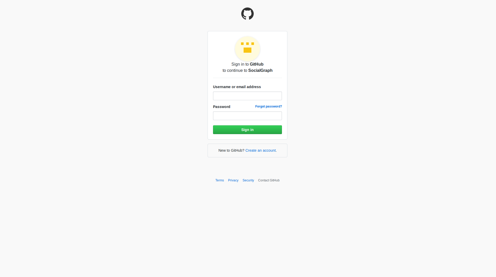
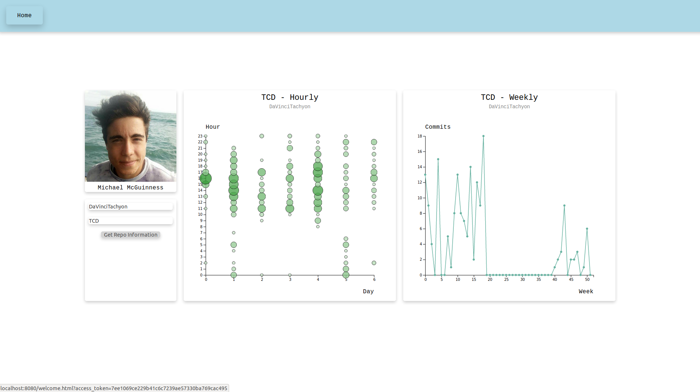

# Social Graph

This application interrogates the GitHub API to build visualisation of data available that elucidates some aspect of the software engineering process, such as a social graph of developers and projects, or a visualisation of individual of team performance.

In order to run the application:

1. Start the server by executing `npm start`
2. Navigate to `http://localhost:8080` on your browser.

## Behaviour

The application has three endpoints:
1. Login button page - `/index.html`
    - Directs to github for login
2. Redirect back to website to allow retrieval of access token - `/oauth/redirect`
3. Main page - `/home.html`

### Logging In

#### Social Graph Log In Page

The login page contains a button `Login with github`, which allows redirection to the main service. It is a button which directs the user to the github OAuth login api.

#### Github Log In Page

This is the page which the login button directs the user to. It only appears to the user if the user is not already logged in to github on the browser. If the user is already logged in, the page will be directed to, however, it will not appear to the user.

#### OAuth Redirect

This endpoint receives the response from github, either refusing or accepting the request to login for the user. If the login is accepted the access token can be extracted and is sent as a parameter to the home page, in order to allow said page to access the Github api as desired.

### Home Page

The home page contains the main contents of the website.

It is built from multiple components.

`Toolbar` - There is a toolbar at the top of the screen with a home button. This may be expanded to allow other pages in the future.

`Image` - The first component is an image with a name underneath. These are the avatar and name of the logged in user.

`Search box` - This search box allows the user to search for the statistics of any users repository.
* The first input is the username. The current default is `DaVinciTachyon`.
* The second input is the user's repository. The current default is `TCD`.

`Hourly Graph` - This graph display the punchcard details for a particular user in a particular repository. What these details are is the amount of commits made at a particular time on a particular day of the week. This may allow the user of the service to inspect for when the user searched for is most productive on this particular repository. This may allow for changes in workflow.

`Ẁeekly Graph` - This graph displays the number of commits per week the searched user has made to this particular repository over the last year. This may allow a user of the service to see when the most work is being done during the year, and potentially make changes accordingly.